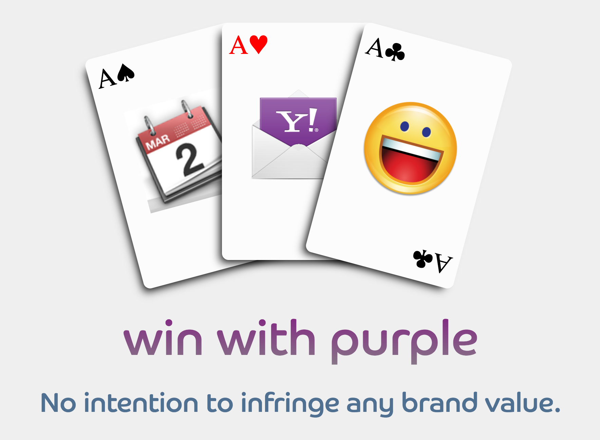

In 2011/12 there was a initiative to design a t-shirt for Yahoo communication products.

This is the logo I conceptualized and designed with the inputs of my then teammates.

It was not the winner, but we liked it very much.

[Sumeet Mulani](https://twitter.com/teemus) even got them printed as stickers.
